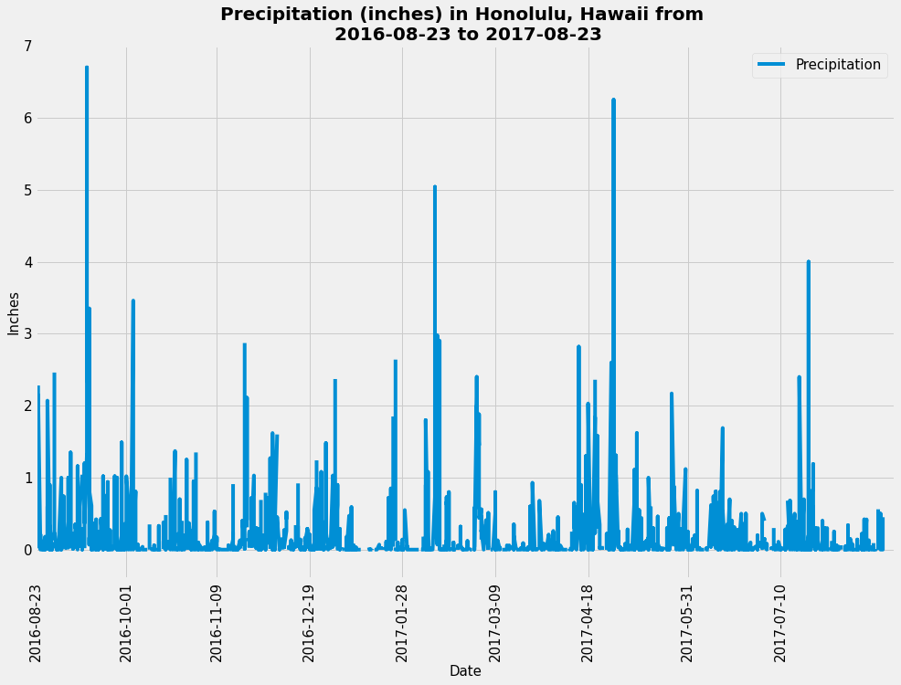

# Python and SQLAlchemy Surfs Up Challenge to Explore Climate Data

## Background

This repository is designed to provide a climate analysis of Honolulu, Hawaii to help surfers (and people) better prepare for their vacation or trip there.

This project is broken up into 2 parts: 
- Analysis & Exploration of the Hawaiian Climate, for which Python and SQLAlchemy were utilized to explore and analyze the climate dataset provided.  
- Visual & Interactive Presentation of the data analyzed, for which a Flask API APP was created in order to present the data findings in a dynamic and customized approach.

## Step 1 - Climate Analysis & Exploration (of Precipitation & Weather Stations)

In addition to using Python, SQLAlchemy to perform climate analysis and explore the data from the given dataset, the following analyses were completed using SQLAlchemy ORM queries, Pandas, and Matplotlib. The complete climate anlysis jupyter notebook file can be found [here](SurfsUp/climate.ipynb), and the SQLAlchemy file is provided [here]; JD create a link to [hawaii.sqlite](SurfsUp/Resources/hawaii.sqlite).

* SQLAlchemy engine created `create_engine` to connect to the sqlite database. ` engine = create_engine("sqlite:///Resources/hawaii.sqlite") 
`inspector = inspect(engine)`

* To reflect the tables into classes, and save a reference to those classes called `Station` and `Measurement` an SQLAlchemy `automap_base()` is used.

###  Precipitation Analysis

* A query was designed to retrieve the last 12 months of precipitation data, and only the `date` and `prcp` values is selected.

* The query results are loaded into a Pandas DataFrame and the index is used as the date column, and sorted the DataFrame values by `date`.

* Then, the result was plotted by using the DataFrame `plot` method. The plot looks as follows:

 

 ###  Station Analysis

* A query is designed to calculate the total number of stations, and 9 stations found. To find the most active station list, and observation counts is sorted in descending order. Station `USC00519281` has the highest number of observations.

* A query is created to retrieve the last 12 months of temperature observation data (TOBS) and filter by the station with the highest number of observations. The Plot for the results as a histogram with `bins=12` were created and it looks as follows. 

- - -

##  Step 2 - Climate App

After the initial analysis was completed, a Flask API was designed based on the queries already previously run in step 1.

* The following routes are created by using Flask. To look and run the code click the following link:[app.py](app.py)

###  Routes

* `/`

  * Home page.

  * List all routes that are available.

* `/api/v1.0/precipitation`

  * Convert the query results to a dictionary using `date` as the key and `prcp` as the value.

  * Return the JSON representation of your dictionary.

* `/api/v1.0/stations`

  * Return a JSON list of stations from the dataset.

* `/api/v1.0/tobs`
  * Query the dates and temperature observations of the most active station for the last year of data.
  
  * Return a JSON list of temperature observations (TOBS) for the previous year.

* `/api/v1.0/<start>` and `/api/v1.0/<start>/<end>`

  * Return a JSON list of the minimum temperature, the average temperature, and the max temperature for a given start or start-end range.

  * When given the start only, calculate `TMIN`, `TAVG`, and `TMAX` for all dates greater than and equal to the start date.

  * When given the start and the end date, calculate the `TMIN`, `TAVG`, and `TMAX` for dates between the start and end date inclusive.
### Notes & References:

  I created this shareable link to my repository <https://github.com/jdelacruzjr/sqlalchemy-challenge.git> and submitted it to <https://bootcampspot-v2.com>
### Copyright

Surf Images © 2019 World Surf League.

Trilogy Education Services © 2023. All Rights Reserved.