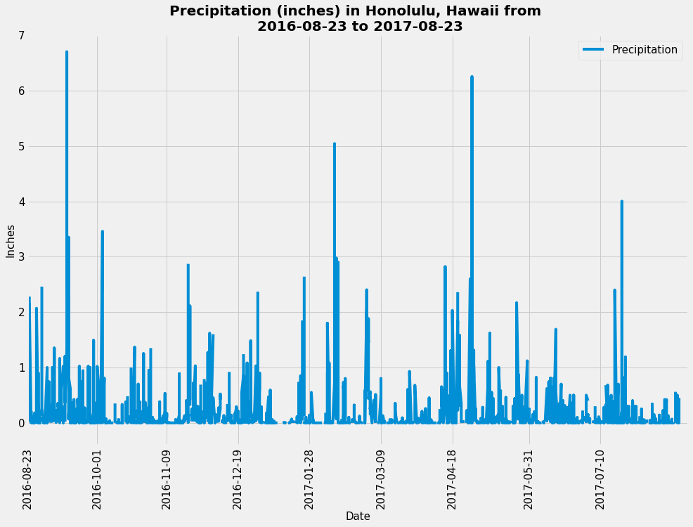

# Python and SQLAlchemy Surfs Up Challenge to Explore Climate Data

## Background

This repository is designed to provide a climate analysis of Honolulu, Hawaii to help people better prepare for their vacation or trip there.

This project is broken up into 2 parts: 
- Climate Analysis & Exploration, for which Python and SQLAlchemy were utilized to explore and analyze data from the climate database provided.  
- Visual & Interactive Presentation of the data analyzed, for which a Flask API APP was created in order to present the data findings in a dynamic and customized approach.

## 1. Climate (Precipitation & Weather Station) Analysis & Exploration

In addition to using Python, SQLAlchemy to perform climate analysis and explore the data from the given dataset, the following analyses were completed using SQLAlchemy ORM queries, Pandas, and Matplotlib. The complete climate anlysis jupyter notebook file can be found [here](climate_ipynb), and the SQLAlchemy file is provided [here]; JD create a link to [hawaii.sqlite](Resources/hawaii.sqlite).

* SQLAlchemy engine created `create_engine` to connect to the sqlite database. ` engine = create_engine("sqlite:///Resources/hawaii.sqlite") 
`inspector = inspect(engine)`

* To reflect the tables into classes, and save a reference to those classes called `Station` and `Measurement` an SQLAlchemy `automap_base()` is used.

###  Precipitation Analysis

* A query was designed to retrieve the last 12 months of precipitation data, and only the `date` and `prcp` values is selected.

* The query results are loaded into a Pandas DataFrame and the index is used as the date column, and sorted the DataFrame values by `date`.

* Then, the result was plotted by using the DataFrame `plot` method. The plot looks as follows:

 

############## JD - left off here at 6:56 am on Apr 10

### Notes & References:

  I created this shareable link to my repository <https://github.com/jdelacruzjr/sqlalchemy-challenge.git> and submitted it to <https://bootcampspot-v2.com>
### Copyright

Trilogy Education Services © 2023. All Rights Reserved.